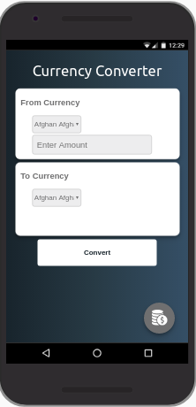

# Currency converter

## About
An app made for the 2018 ALC with Google scholarship challenge 2.0 AKA 7daysofcode.
A currency converter PWA that uses offline first strategies.

## Futures
- Convert from one currency to another online and use them offline for the next time
- Able to be used as pwa app on smartphones.
- Well designed interface that works on different devices.
- Updates exchange rates automatically every two hours i.e App keeps it self up to date with the recent exchange rates. 

## Testing
To develope or test on your machine simply clone the repository then host on your machines localhost.